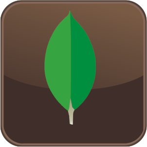
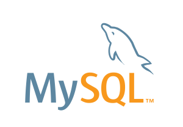

# Languages-and-Tools
Languages and Tools
### 📖 [Languages and Tools](https://github.com/Eduardoreisboattini/Languages-and-Tools)

Here are some of the key programming languages and tools I have utilized in my projects, along with a brief explanation of each:

#### 1. W3C
- 
- The [W3C](https://w3.org) (World Wide Web Consortium) sets standards for the World Wide Web, ensuring interoperability and consistency in web technologies.
 
#### 2. JavaScript
- 
- [JavaScript](https://developer.mozilla.org/en-US/docs/Web/JavaScript) is a versatile and widely-used programming language that allows me to create interactive and dynamic elements on websites.
 
#### 3. React
- 
- [React](https://react.dev/) is a popular JavaScript library for building user interfaces, enabling me to create reusable UI components for efficient development.
 
#### 4. Redux

[Redux](https://redux.js.org/) is a powerful state management library that complements React, enabling efficient management of application state in a predictable and organized manner.
 
#### 5. Node.js
- 
- [Node.js](https://nodejs.org/en) is a server-side JavaScript runtime that enables me to build scalable and fast server applications.
 
#### 6. Express
- 
- [Express](http://expressjs.com/) is a minimal and flexible Node.js web application framework that allows me to build robust APIs and web applications.
 
#### 7. Git
- 
- [Git](https://git-scm.com/) is a distributed version control system that helps me track changes and collaborate with other developers effectively.
 
#### 8. MongoDB
- 
- [MongoDB](https://www.mongodb.com/) is a NoSQL database that provides flexible and scalable storage for my applications.
 
#### 9. MySQL
- 
- [MySQL](https://www.mysql.com/) is a popular relational database management system, allowing me to store and retrieve data efficiently.
 
#### 10. SQLite
- 
- [SQLite](https://www.sqlite.org/index.html) is a self-contained, serverless, and zero-configuration SQL database engine, making it a great choice for small-scale applications and testing.
 
#### 11. PHP
- 
- [PHP](https://www.php.net) is a server-side scripting language primarily used for web development, enabling me to create dynamic and interactive web pages.
 
#### 12. C#
- 
- [C#](https://dotnet.microsoft.com/en-us/languages/csharp) is a versatile and object-oriented programming language used in various domains, including desktop, web, and game development.
 
#### 13. C++
- 
- [C++](https://learn.microsoft.com/en-us/cpp/cpp) is a powerful and efficient programming language commonly used for system and application software.
 
#### 14. Python
- 
- [Python](https://www.python.org/) is a high-level programming language known for its simplicity and readability, suitable for a wide range of applications, including data science and web development.
 
#### 15. 
- 
- [TensorFlow](https://www.tensorflow.org/) is an open-source machine learning library developed by Google, providing a comprehensive ecosystem for building and training machine learning models.
 
#### 16. Bootstrap
- 
- [Bootstrap](https://getbootstrap.com/) is a popular CSS framework that helps me create responsive and visually appealing user interfaces quickly.

These languages and tools have been instrumental in enabling me to create diverse and innovative projects, from web applications to machine learning implementations. Each technology brings its unique strengths to the table, allowing me to tackle a wide range of challenges in my programming journey.
